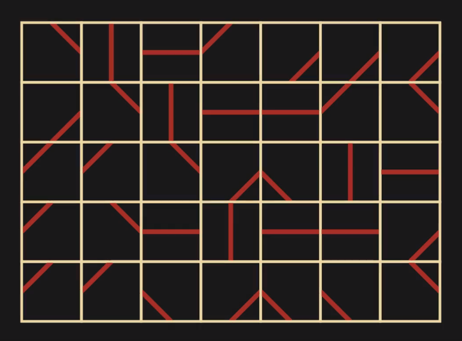
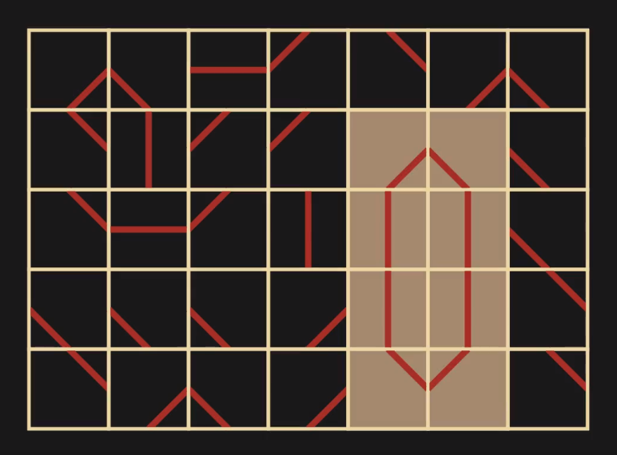

# The Mosaic Problem

Consider the following 6 tiles. 

Imagine placing these tiles in an $n \times m$ rectangular grid, like so.

How many of these tilings, or *mosaics*, contain atleast one enclosed region for a given $n,m$? 

This questions turns out to be difficult for general $n,m$, though bounds on a similar problem were given by Hong and Oh in [this](https://arxiv.org/abs/1806.09717) paper. 

This repository focuses on the $m=2$ and $m=3$ cases. If we let $t_{n,m}$ be the number of mosaics that contain atleast one enclosed region. Then for $m=2$ we have

$$\sum_{n \geq 2}t_{n,2}x^n = \frac{x^2}{(1-36x)(1-37x+37x^2)}.$$

This gives for $n \geq 2$, that

$$t_{n,2}= 6^{2n} - \frac{1}{\beta-\alpha}((36\beta-35)\beta^{-n+1} - (36\alpha - 35)\alpha^{-n+1}),$$

where $\alpha = \frac{1}{2} + \frac{1}{2}\sqrt{\frac{33}{37}}$ and $\beta = \frac{1}{2} - \frac{1}{2}\sqrt{\frac{33}{37}}$. 

For the $m=3$ case, we have

$$\sum_{n \geq 2}t_{n,3}x^n = \frac{(73-414x)x^2}{(1-216x)(1-228x+2699x^2-7758x^3)}.$$

A video summarizing this work can be found [here](https://www.youtube.com/watch?v=D3dp5RBmPcs&t=921s). This video won an honorary mention in the [2023 Summer of Math Exposition](https://www.youtube.com/watch?v=6a1fLEToyvU&list=PLctYr3TOAdIE7MNyc8ejPUvda-g7VVVNt) contest.

<!-- https://pastebin.com/WKay2HjU -->
<!-- https://oeis.org/A181245 -->

## Developer Notes

To refresh bib references, run `biber mosaics` .

## Citations w/ Links

Papers are of the form: #. paper title (year published to arXiv / published).

To begin,
0. [Quantum Knots and Mosaics (2008)](https://arxiv.org/abs/0805.0339): The knot tileset and its apparent relationship with quantum mechanics is introduced

Inspired by this, Seungsang Oh (who also sent me the paper you had the library find a few days later) and various colleagues published the following papers concerning the enumeration of these mosaics.
1. [Quantum knots and the number of knot mosaics (2014)](https://arxiv.org/abs/1412.4460): Found a recursive matrix definition analogous to the method we have been discussing in our meetings to enumerate the knot tileset introduced in 0.
2. [Quantum knot mosaics and the growth constant (2016)](https://arxiv.org/abs/1609.00517): Derived upper and lower bounds for the growth rate (called delta) using main result from 1. They find 4 <= delta <= 4.303
3. [Growth rate of quantum knot mosaics (2019)](https://link.springer.com/article/10.1007/s11128-019-2353-z): Improved upper bound on delta, delta <= 4.113
4. [Quantum knot mosaics and bounds of the growth constant (2024)](https://worldscientific.com/doi/10.1142/S0129055X24500259): Improved upper bound on delta, delta <= 4.103

And most importantly for our discussion, the paper I was hoping to respond to :
5. [Bounds on multiple self-avoiding polygons(2018)](https://arxiv.org/abs/1806.09717): Provides bounds for an alternative tileset that creates self-avoiding polygons, not knots

It is interesting to point out that 5 was published four years after 1, and yet no exact enumeration of the problem studied in 5 is provided. 5 Only has two citations, and only 1 in-text citation.

Additionally, the journals these papers are published in are as follows:
0. 1. 2. and 3. are published in [Quantum Information Processing](https://link.springer.com/journal/11128)
4. is published in [Reviews in Mathematical Physics](https://worldscientific.com/worldscinet/rmp)
5. is published in [Canadian Mathematical Bulletin](https://www.cambridge.org/core/journals/canadian-mathematical-bulletin)
